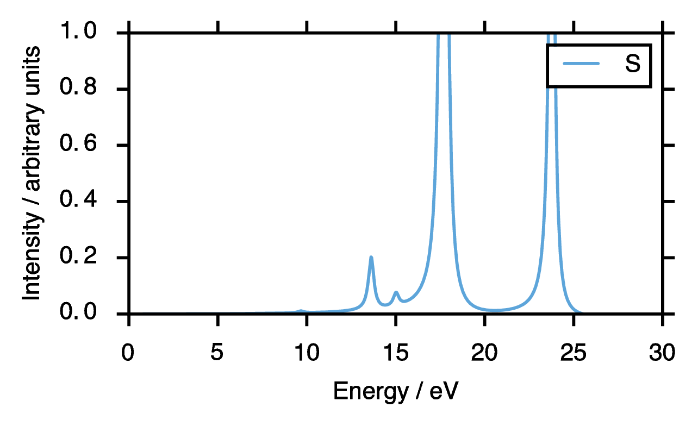
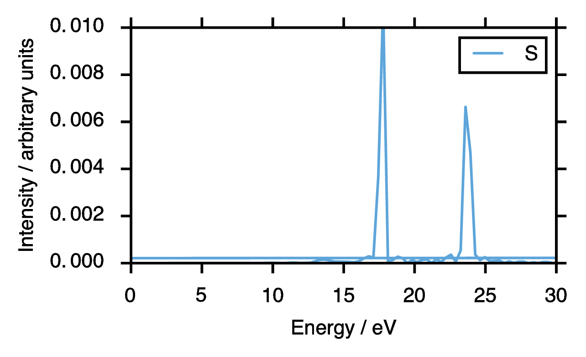

# cq_realtime 

This is a python script to generate the absorption spectrum from a real time time-dependent SCF calculation in the output of [Chronus Quantum](https://github.com/liresearchgroup/chronusq_public).

It also provides the options to try compressed sensing techniques on your time series. (Still experimental, so see end of this `README`).

## Use

You can run the script as-is on the provided output (water/Restricted Hartree-Fock/STO-3G), just:

```bash
$ python cq_realtime.py
```

The files are hard-coded into the main part of the script. You can always import the function `cqRealTime` in your own python scripts like so:
```python
from cq_realtime import cqRealTime
``` 

### Arguments
```python
def cqRealTime(real_time_file,dipole_direction,kick_strength,damp_const):
    '''
        CQ_RealTime.py: a post-processing script for computing the absorption spectrum of
         Real Time Time Dependent SCF jobs in Chronus Quantum

        Computes the energy range, w (in eV) and dipole strength function S(w) for
         a given real time TD-SCF run.

        real_time_file   ... type:string ; the RealTime_Dipole.csv file from a ChronusQ run
        dipole_direction ... type:char   ; which dipole moment contribution is computed (e.g. 'x','y', or 'z')
        kick_strength    ... type:float  ; in a.u., what was the applied field strength (e.g. 0.0001 au)
        damp_const       ... type:float  ; in a.u. of time, gives FWHM of 1/damp_const
        cs               ... type:boolean; if True, do compressed sensing instead of Fourier Transform
    '''
```

Returns `w`, and `S`, which are the frequencies and absorption cross sections.

## Theory(-ish)

Three input files are included for water in a STO-3G basis. If you have ChronusQ installed, you can run these files.

To get the absorption spectrum you need to give the system three independent "perturbations," so we give the system a delta-function electric field "kick" at the beginning (e.g. turn on the field for one time step) in three different directions (x,y,z).

Then we measure the time-evolving dipole moment of the system along the polarization of that field. A Fourier transform of this time evolution is proportional to the dipole strength function, and also related to the absorption cross section (which we measure in lab in a UV-Vis experiment).

The overall dipole strength function is determined by adding the "x dipole response to the x-delta kick" to the "y dipole response to the y-delta kick" to the "z dipole response to the z-delta kick".

## Requirements

This code is written in Python 2.7 and requires [numpy](http://www.numpy.org/), [matplotlib](http://matplotlib.org/), and [SciPy](http://www.scipy.org/). On Ubuntu you can just: 

```bash
$ sudo apt-get install python-numpy python-scipy python-matplotlib 
```

Or on Fedora:
```bash
$ sudo yum install numpy scipy python-matplotlib 
```

For Mac OS X, if you use [Macports](http://www.macports.org/):
```bash
$ sudo port install py27-numpy py27-scipy py27-matplotlib 
```

## Example: STO-3G water
For comparison, if you do the FFT analysis of the real-time data on the water example provided, your peaks and relative intensities should match the output below:

Remember, `f` is the dimensionless oscillator strength, and gives the magnitude of your peak at the given energy. So you should see a large peak at 17.7 eV, since it has the largest `f`, but no peak at 11.3 eV, because its `f` is zero.

``` 

 Excited State   1:      Singlet-B1     9.6540 eV   f=0.0021 

 Excited State   2:      Singlet-A2    11.3014 eV   f=0.0000 

 Excited State   3:      Singlet-A1    13.6088 eV   f=0.0548 

 Excited State   4:      Singlet-B2    15.0044 eV   f=0.0140 

 Excited State   5:      Singlet-B2    17.6951 eV   f=1.0986 

 Excited State   6:      Singlet-A1    23.7684 eV   f=0.6030 

 Excited State   7:      Singlet-A1    34.9187 eV   f=0.0219

 Excited State   8:      Singlet-B2    36.0245 eV   f=0.0022 

```



## Experimental: Compressed Sensing
If you want, you can try using compressed sensing techniques to replace the Fourier transform.

In principle, this is a technique to exploit the sparsity in the Fourier transform to beat the [Nyquist–Shannon sampling theorem](https://en.wikipedia.org/wiki/Nyquist%E2%80%93Shannon_sampling_theorem).

It is more expensive, so the default is to prune your time series to the first 1000 samples.

Details of the theory can be found in:
 
>Andrade, X., Sanders, J. N., & Aspuru-Guzik, A. (2012). Application of compressed sensing to the simulation of atomic systems. Proceedings of the National Academy of Sciences of the United States of America, 109(35), 13928–13933. http://doi.org/10.1073/pnas.1209890109

To use, you'll need to get the CVXPY package: http://www.cvxpy.org/

You can use `pip`:

```
  pip install cvxpy
```

To use, open the `cq_realtipme.py` file. Edit the option `doCS` at the bottom so that `doCS = True`. This will do the compressed sensing technique when you run `cq_realtime`. Feel free to play around with the defaults. The CS function is found in `cs.py`. 

The default is to do a Basis Pursuit Denoising (BPDN) problem with a noise value of 1e-7, and a frequency space augmentation of 5 times the size of your time series. Time series are pruned to first 1000 samples.

Here is an example of what you get when you do the CS technique on the first 1000 samples of the `h2o_RealTime` datasets. On my machine it took around 30s to compute. On older machines this default setting may take upwards of a few minutes.




